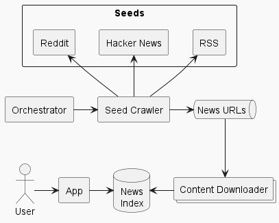

# News aggregator

I frequently visit news aggregator websites like [Hacker News](https://news.ycombinator.com) and [Reddit](https://reddit.com) and recently I had the idea to build my own aggregator to see all news in a single web application. At first, I built a stand-alone multi-threaded web app to list, search and recommend news on top of [Lucene](https://lucene.apache.org) and then scaled it with [Kafka](https://kafka.apache.org) and [Elasticsearch](https://www.elastic.co).

Although you can compile and run this project, it is not finished yet, but feel free to dive into the code if you're interested. Here's an architecture diagram to guide you:

